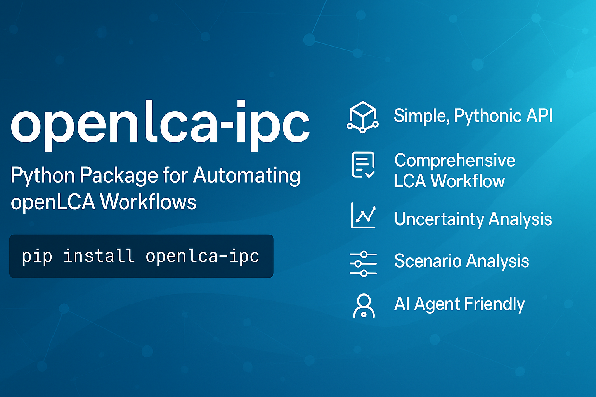

# openLCA IPC Python Library

A comprehensive Python library for interacting with openLCA desktop application through the IPC (Inter-Process Communication) protocol. Built for life cycle assessment (LCA) workflows based on ISO-14040/14044 standards.

[](https://www.python.org/downloads/)
[](LICENSE)
[](https://www.openlca.org/)
[](https://doi.org/10.5281/zenodo.17567634)

You can cite all versions by using the DOI 10.5281/zenodo.17567634. This DOI represents all versions, and will always resolve to the latest one.

## Features

- **Simple, Pythonic API** - High-level utilities that abstract complex IPC operations
- **Comprehensive LCA Workflow** - Search, create, calculate, and analyze in one package
- **Contribution Tree** - Recursive upstream contribution trees with depth/share pruning
- **Full LCI Inventory** - Elementary-flow inventory with input/output direction filter
- **Normalization & Weighting** - Normalized and weighted impacts in consistent dict format
- **Sankey Data** - Sankey graph data as plain dicts for visualization or MCP tools
- **Scenario Comparison** - `compare_systems()` returns per-category difference tables
- **Uncertainty Analysis** - Monte Carlo simulations with statistical summaries
- **Parameter Scenarios** - Sensitivity analysis over named parameters
- **Export Utilities** - CSV and Excel export for results
- **Agent Layer** - Compact JSON summaries, reproducibility metadata, and recoverable structured errors for AI agents and MCP servers
- **Read-Only Safe Mode** - `OLCAClient(read_only=True)` blocks all writes at the Python layer
- **Result Consistency Checks** - Runtime invariant warnings when contributions diverge from totals
- **ISO Compliant** - Follows ISO-14040/14044 LCA standards

## Installation

### Prerequisites

- Python 3.10 or higher
- openLCA desktop application (version 2.x)
- openLCA IPC server running (Tools → Developer Tools → IPC Server)

### Install from PyPI

```bash
pip install openlca-ipc
```

### Install from Source

```bash
# Clone the repository
git clone https://github.com/SDAI-institute/openlca-ipc.git
cd openlca-ipc

# Install in editable mode
pip install -e .

# Or install with optional dependencies
pip install -e ".[full]"
```

### Install Dependencies

```bash
# Core dependencies only
pip install -r requirements.txt

# Development dependencies
pip install -r requirements-dev.txt
```

## Quick Start

### 1. Start openLCA IPC Server

Before using the library, start the IPC server in openLCA:

1. Open openLCA desktop application
2. Go to **Tools → Developer Tools → IPC Server**
3. Click **Start** (default port: 8080)

### 2. Basic Usage

```python
from openlca_ipc import OLCAClient

# Connect to openLCA
with OLCAClient(port=8080) as client:
    # Test connection
    if client.test_connection():
        print("Connected to openLCA!")

    # Search for a material
    steel_flow = client.search.find_flow(['steel', 'production'])
    print(f"Found: {steel_flow.name}")

    # Find provider process
    provider = client.search.find_best_provider(steel_flow)
    print(f"Provider: {provider.name if provider else 'None'}")
```

## Usage Examples

### Example 1: Complete LCA Workflow

```python
from openlca_ipc import OLCAClient

with OLCAClient(port=8080) as client:
    # 1. Search for materials
    steel = client.search.find_flow(['steel'])
    steel_provider = client.search.find_best_provider(steel)

    # 2. Create a new process
    product = client.data.create_product_flow("Steel plate")
    exchanges = [
        client.data.create_exchange(product, 1.0, is_input=False, is_quantitative_reference=True),
        client.data.create_exchange(steel, 1.0, is_input=True, provider=steel_provider)
    ]
    process = client.data.create_process("Plate production", exchanges=exchanges)

    # 3. Create product system
    system = client.systems.create_product_system(process)

    # 4. Select impact method
    method = client.search.find_impact_method(['TRACI'])

    # 5. Calculate impacts
    result = client.calculate.simple_calculation(system, method)

    # 6. Get results
    impacts = client.results.get_total_impacts(result)
    for impact in impacts:
        print(f"{impact['name']}: {impact['amount']:.4e} {impact['unit']}")

    # 7. Clean up
    result.dispose()
```

### Example 2: Contribution Analysis

```python
from openlca_ipc import OLCAClient

client = OLCAClient(port=8080)

# Run calculation with contribution analysis
result = client.calculate.contribution_analysis(system, method)

# Get all impacts
impacts = client.results.get_total_impacts(result)

# Analyze top contributors for each impact
for impact in impacts:
    print(f"\n{impact['name']}:")

    # Get top 5 contributors
    contributors = client.contributions.get_top_contributors(
        result,
        impact['category'],
        n=5,
        min_share=0.01  # Minimum 1% contribution
    )

    for i, contrib in enumerate(contributors, 1):
        print(f"  {i}. {contrib.name}: {contrib.share*100:.1f}% ({contrib.amount:.4e})")

result.dispose()
```

### Example 3: Monte Carlo Uncertainty Analysis

```python
from openlca_ipc import OLCAClient
import matplotlib.pyplot as plt

client = OLCAClient(port=8080)

# Run Monte Carlo simulation
results = client.uncertainty.run_monte_carlo(
    system=my_system,
    impact_method=traci_method,
    iterations=1000,
    progress_callback=lambda i, total: print(f"Progress: {i}/{total}")
)

# Analyze global warming potential
gwp_key = next(k for k in results.keys() if 'warming' in k.lower())
gwp_result = results[gwp_key]

print(f"Mean: {gwp_result.mean:.4e}")
print(f"Std Dev: {gwp_result.std:.4e}")
print(f"CV: {gwp_result.cv:.2%}")
print(f"95% CI: [{gwp_result.percentile_5:.4e}, {gwp_result.percentile_95:.4e}]")

# Plot distribution
plt.figure(figsize=(10, 6))
plt.hist(gwp_result.values, bins=50, edgecolor='black', alpha=0.7)
plt.axvline(gwp_result.mean, color='red', linestyle='--', label='Mean')
plt.xlabel('Global Warming Potential')
plt.ylabel('Frequency')
plt.title('Monte Carlo Simulation Results')
plt.legend()
plt.savefig('gwp_distribution.png')
```

### Example 4: Scenario Analysis

```python
from openlca_ipc import OLCAClient
import pandas as pd

client = OLCAClient(port=8080)

# Analyze how transport distance affects impacts
scenarios = client.parameters.run_scenario_analysis(
    system=transport_system,
    impact_method=traci_method,
    parameter_name='transport_distance',
    values=[100, 200, 500, 1000, 2000, 5000]
)

# Create comparison DataFrame
data = []
for distance, impacts in scenarios.items():
    row = {'Distance (km)': distance}
    for impact in impacts:
        row[impact['name']] = impact['amount']
    data.append(row)

df = pd.DataFrame(data)
print(df)

# Export to CSV
client.export.export_comparison_to_csv(scenarios, 'scenario_results.csv')
```

## AI Agent & MCP Automation

`openlca-ipc` ships a built-in **agent layer** (`openlca_ipc.agent`) for use directly from AI agents or MCP servers — no extra repo needed:

```python
from openlca_ipc import OLCAClient, ResultSummary, health_check

with OLCAClient(port=8080, read_only=True) as client:
    print(health_check(client))            # server probe + entity counts
    result = client.calculate.simple_calculation(system, method)
    impacts = client.results.get_total_impacts(result)
    summary = ResultSummary.from_impacts(impacts, product_system=system)
    print(summary.to_json())               # compact JSON for the agent
    result.dispose()
```

| MCP tool | Backed by |
|---|---|
| `openlca_health` | `health_check(client)` |
| `openlca_search` | `client.search.*` → `EntitySummary` |
| `openlca_calculate` | `simple_calculation` → `ResultSummary` |
| `openlca_contribution_tree` | `contributions.get_contribution_tree` |
| `openlca_compare_scenarios` | `calculate.compare_systems` |

See [`documentation/agent-usage.md`](documentation/agent-usage.md) for the full MCP builder guide.

## Module Overview

The library is organized into specialized modules:

- **`OLCAClient`** - Main client for connecting to openLCA IPC server (`read_only=True` for safe mode)
- **`search`** - Search and discovery utilities for flows, processes, and impact methods
- **`data`** - Create and modify flows, exchanges, and processes
- **`systems`** - Build and configure product systems
- **`calculate`** - Run LCA calculations and compare scenarios
- **`results`** - Extract and format results (impacts, inventory, normalization, Sankey, requirements)
- **`contributions`** - Contribution analysis, top contributors, and recursive contribution trees
- **`uncertainty`** - Monte Carlo simulations and statistical analysis
- **`parameters`** - Parameter scenarios and sensitivity analysis
- **`export`** - Export results to CSV, Excel, and other formats
- **`agent`** - Compact JSON summaries, reproducibility context, structured errors, health check (AI/MCP layer)
- **`diagnostics`** - Runtime result consistency checks

## Best Practices

### 1. Always Dispose Results

```python
# Good - automatic cleanup with context manager
with OLCAClient(port=8080) as client:
    result = client.calculate.simple_calculation(system, method)
    impacts = client.results.get_total_impacts(result)
    result.dispose()  # Always dispose!

# Also good - explicit cleanup
client = OLCAClient(port=8080)
try:
    result = client.calculate.simple_calculation(system, method)
    # Process results
finally:
    result.dispose()
```

### 2. Handle Missing Data

```python
# Always check search results
pet_flow = client.search.find_flow(['polyethylene', 'terephthalate'])

if not pet_flow:
    # Try alternative keywords
    pet_flow = client.search.find_flow(['PET'])

if not pet_flow:
    print("Material not found in database")
    return

# Proceed safely
provider = client.search.find_best_provider(pet_flow)
```

### 3. Use Logging

```python
import logging

# Enable logging to see what's happening
logging.basicConfig(
    level=logging.INFO,
    format='%(asctime)s - %(name)s - %(levelname)s - %(message)s'
)

# Library modules will log automatically
client = OLCAClient(port=8080)
# Output: "INFO - Connected to openLCA IPC server on port 8080"
```

## Documentation

- **[Quick Start](documentation/quickstart.md)** - Step-by-step guide including v0.4 analysis functions
- **[Agent & MCP Guide](documentation/agent-usage.md)** - Structured responses, reproducibility, safe mode
- **[API Reference](documentation/api/README.md)** - Module structure and all API methods
- **[Setup Guide](documentation/installation.md)** - Detailed installation and configuration
- **[Examples](examples/)** - Working example scripts and Jupyter notebooks
- **[Complete Documentation](documentation/index.md)** - Full documentation hub

## Requirements

### Core Dependencies

- `olca-ipc>=2.4.0` - openLCA IPC protocol implementation
- `olca-schema>=2.4.0` - openLCA data schema
- `numpy>=1.24.0` - Numerical operations

### Optional Dependencies

Install with `pip install openlca-ipc[full]`:

- `scipy>=1.10.0` - Statistical analysis for uncertainty
- `matplotlib>=3.7.0` - Visualization
- `pandas>=2.0.0` - Data export and analysis

## Development

### Setting Up Development Environment

```bash
# Clone repository
git clone https://github.com/SDAI-institute/openlca-ipc.git
cd openlca-ipc

# Create conda environment (if using conda)
conda create -n openlca_dev python=3.11
conda activate openlca_dev

# Install in editable mode with dev dependencies
pip install -e ".[full]"
pip install -r requirements-dev.txt
```

### Running Tests

```bash
# Install test dependencies
pip install pytest pytest-cov

# Run tests (mocked suite only — this is what CI runs; live tests are
# excluded by default via the `not live` addopts in pyproject.toml)
pytest tests/

# Run with coverage
pytest --cov=openlca_ipc tests/
```

### Live integration tests

Tests marked `@pytest.mark.live` exercise the library against a **real,
running openLCA instance** instead of mocks. They are excluded from the
default `pytest` run (and from CI) and must be run explicitly:

```bash
# 1. Start openLCA Desktop, open a database, and start the IPC server
#    (Tools -> Developer tools -> IPC server). Default port 8080; override
#    with OLCA_IPC_PORT if needed.

# 2. Run the live suite
pytest -m live

# Or a specific file:
pytest -m live tests/test_golden_live.py       # synthetic system, any DB, no license needed
pytest -m live tests/test_unit_fuzzing_live.py # unit-derivation regression (F1 bug class)
pytest -m live tests/test_search_live.py       # provider-location invariants (F3 bug class)

OLCA_IPC_PORT=9090 pytest -m live              # custom port
```

Three tiers of live tests, by database requirement:

| File | Requires | What it checks |
|---|---|---|
| `test_live_integration.py` | any openLCA DB | basic connect/search/create/calculate smoke tests |
| `test_golden_live.py` | any openLCA DB (no license) | a fully synthetic system with a **hand-derived** expected answer (see `openlca-ipc case studies/case2-golden-handcalc.md`) — determinism + linear-scaling regression |
| `test_unit_fuzzing_live.py`, `test_search_live.py` | a background dataset (e.g. ecoinvent) for realistic flow/provider variety | non-mass unit derivation and provider-geography invariants; individual cases are skipped (not failed) if a needed flow isn't present |
| `test_golden_pet_live.py` | ecoinvent 3.10 Cutoff specifically | regression guard against `fixtures/pet_golden.json`, our own verified PET/PC tutorial reproduction (see `openlca-ipc case studies/case1-report.md`) |

All live tests create entities with a distinctive name prefix and delete them
in a `finally`/fixture-teardown block, so a failed run should not leave test
data behind — but if it does, filter the openLCA Navigator by the prefix
shown in the test file to clean up manually.

### Code Quality

```bash
# Format code
black openlca_ipc/

# Lint code
flake8 openlca_ipc/

# Type checking
mypy openlca_ipc/
```

## Contributing

Contributions are welcome! Please feel free to submit a Pull Request.

1. Fork the repository
2. Create your feature branch (`git checkout -b feature/amazing-feature`)
3. Commit your changes (`git commit -m 'Add amazing feature'`)
4. Push to the branch (`git push origin feature/amazing-feature`)
5. Open a Pull Request

## Troubleshooting

### Connection Refused Error

**Problem**: Cannot connect to openLCA IPC server

**Solution**:
1. Ensure openLCA desktop application is running
2. Start IPC server: Tools → Developer Tools → IPC Server
3. Check port number (default: 8080)
4. Verify firewall settings

### Material Not Found

**Problem**: Search returns `None` for materials

**Solution**:
1. Check if the material exists in your openLCA database
2. Try different search keywords
3. Use partial matching: `client.search.find_flows(['steel'])` instead of exact names

### Zero Impact Values

**Problem**: All impact values are zero or very small

**Solution**:
1. Verify that input exchanges have providers linked
2. Check that the product system was created correctly
3. Ensure the impact method is appropriate for your flows
4. Verify that your database has characterization factors

## License

This project is licensed under the MIT License - see the [LICENSE](LICENSE) file for details.

## Citation

If you use this library in your research, please cite:

```bibtex
@software{openlca_ipc,
  author = {Danquah Boakye, Ernest},
  title = {openLCA IPC Python Library},
  year = {2025},
  url = {https://github.com/SDAI-institute/openlca-ipc}
}
```

## Acknowledgments

- Built on top of [olca-ipc](https://github.com/GreenDelta/olca-ipc.py) and [olca-schema](https://github.com/GreenDelta/olca-schema)
- Follows [ISO 14040](https://www.iso.org/standard/37456.html) and [ISO 14044](https://www.iso.org/standard/38498.html) standards
- Inspired by the openLCA community and LCA practitioners worldwide

## Support

- **Issues**: [GitHub Issues](https://github.com/SDAI-institute/openlca-ipc/issues)
- **Documentation**: [Read the Docs](documentation/DOCUMENTATION_MAP.md)
- **Email**: dernestbanksch@gmail.com

---

**Made with ❤️ for the LCA Community**
